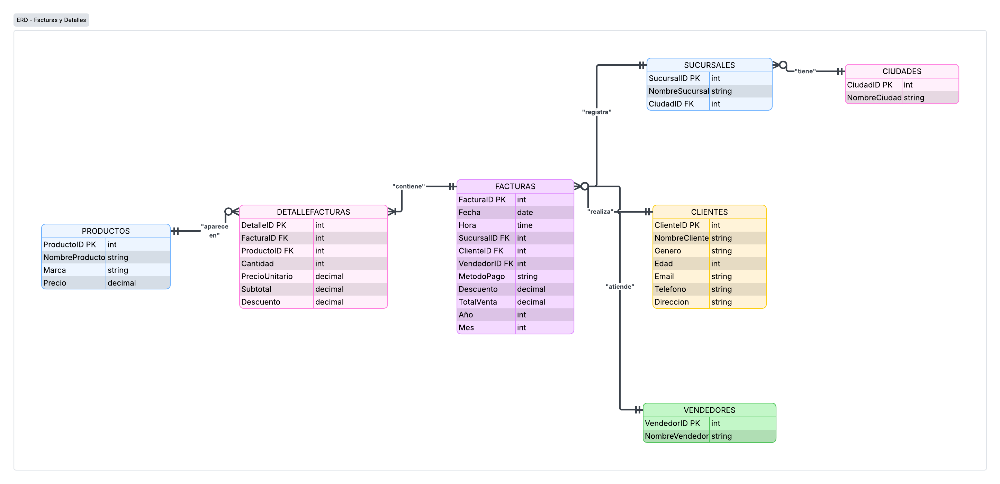

# TechCore: análisis de ventas y dashboard interactivo

Proyecto Integrador del Módulo 3 (Business Intelligence y Visualización de Datos) de la carrera de Data Science en Soy Henry. Caso simulado: una consultora le pide a un Analista de Datos Junior llevar la facturación cruda de una cadena de tiendas hasta un panel que la dirección pueda usar para decidir.

## El problema en una línea

TechCore vende computadores y accesorios en **6 sucursales de 4 ciudades de Colombia** y nunca ha depurado ni analizado su base de facturación. La pregunta: **¿cómo se convierten 30.307 facturas crudas en información con la que la dirección pueda decidir?**

| | |
| --- | --- |
| **Datos de entrada** | 30.307 facturas crudas · 30 columnas |
| **Datos de salida** | 30.000 facturas limpias en un modelo relacional de 7 tablas |
| **Dashboard** | 9 medidas DAX · 2 jerarquías · 5 segmentaciones dinámicas |
| **Periodo analizado** | septiembre de 2014 a septiembre de 2025 |
| **Herramientas** | Power Query · Python (pandas) · Power BI · DAX |

## Tres fases, cada una sobre la anterior

| Fase | Qué se hizo | Herramienta | Resultado |
| --- | --- | --- | --- |
| **1. Limpieza y transformación** | Duplicados, nulos, nombres de columnas, tipos de dato y textos escritos de múltiples formas | Power Query | Facturas confiables y estandarizadas |
| **2. Modelo relacional** | Pasar de una tabla plana a 7 entidades con llaves primarias y foráneas; control de calidad | Python · pandas | Modelo validado en Excel |
| **3. Dashboard interactivo** | Modelo en Power BI, medidas DAX, jerarquías, segmentaciones y visualizaciones | Power BI · DAX | Panel para explorar el desempeño comercial |

El hilo conductor: la primera fase hace los datos **confiables**, la segunda los hace **analizables** y la tercera los hace **comunicables**.

## Lo que el análisis de los datos fue encontrando

Varios errores solo aparecieron en una fase posterior a la que los originó. La lección: el trabajo se verifica en uso, no solo al construirlo.

| Hallazgo | Dónde apareció | Cómo se resolvió |
| --- | --- | --- |
| Ciudades, sucursales y marcas escritas de varias formas | Fase 1 | Normalización de cada variante a su forma correcta |
| Fechas que se perdían al exportar desde Power BI | Fase 1 | Conversión a texto como último paso antes de exportar |
| Precios inflados diez veces por un cero de más | Fase 2 | Corrección al precio válido de cada producto |
| Totales de factura que no cuadraban con sus componentes | Fase 2 | Recálculo con la fórmula correcta |
| Ciudades "no especificadas" que sí se podían deducir | Fase 2 | Deducción de la ciudad desde el nombre de la sucursal |
| Cambio de escala del descuento al modificar su tipo de dato | Fase 2 | Ajuste de la fórmula del total |
| Error de granularidad en la medida de ventas al filtrar por marca | Fase 3 | Reformulación de la medida con `SUMX` sobre el detalle |

## Modelo relacional

<p align="center">
  
</p>

La transformación central fue llevar los productos de **columnas repetidas a filas de una tabla de detalle**, lo que elimina el límite artificial de tres productos por factura.

## Conclusiones para el negocio

- **Medellín y Bogotá concentran el 75% de las ventas** (44,6% y 30,8%). No es solo porque tengan dos tiendas cada una: la sucursal Medellín #1 vende el doble que las de Cali o Pereira. Es una tienda excepcional, no solo una ciudad con más presencia.
- **Cuatro marcas explican más del 80% del negocio.** Apple vende menos de la mitad de unidades que Lenovo pero genera casi dos tercios de sus ingresos: valor sobre volumen. Razer es el caso contrario: el precio promedio más alto del catálogo y menos del 1% de las ventas, capital inmovilizado.
- **El negocio es estable, pero no crece.** Entre 2015 y 2024 las ventas anuales oscilan entre 225 y 238 mil millones de pesos, con una variación menor al 6% entre el mejor y el peor año, incluso durante 2020. Es sólido y predecible, y también estancado: la conclusión estratégica central.
- **Los clientes casi no regresan:** 1,72 compras por cliente en once años. Para una cadena donde los equipos se renuevan cada tres a cinco años, es una oportunidad de fidelización desaprovechada.

El análisis completo, con seis recomendaciones, está en [`docs/conclusiones_y_recomendaciones.pdf`](docs/conclusiones_y_recomendaciones.pdf).

## Cómo explorarlo

- **Dashboard y limpieza:** abrir los archivos de [`powerbi/`](powerbi/) con Power BI Desktop. Si Power BI pide reubicar la fuente de datos, apuntar a los archivos de la carpeta [`data/`](data/).
- **Modelo relacional en Python:**

  ```bash
  git clone https://github.com/SimonBedoyaMontiel/techcore-sales-dashboard.git
  cd techcore-sales-dashboard
  pip install -r requirements.txt
  jupyter notebook notebooks/02_modelo_relacional.ipynb
  ```

- **Documentación:** cada fase tiene su informe en [`docs/`](docs/), y la guía general resume cómo se conectan.

## Estructura del repositorio

```
├── docs/
│   ├── 00_guia_general.pdf                     # Visión de conjunto del proyecto
│   ├── 01_avance1_limpieza.pdf                 # Fase 1 en detalle
│   ├── 02_avance2_modelo_relacional.pdf        # Fase 2 en detalle
│   ├── 03_avance3_dashboard.pdf                # Fase 3 en detalle
│   └── conclusiones_y_recomendaciones.pdf      # Hallazgos y recomendaciones
├── powerbi/
│   ├── 01_limpieza_transformacion.pbix         # Limpieza en Power Query
│   └── 03_dashboard_interactivo.pbix           # Dashboard final
├── notebooks/
│   └── 02_modelo_relacional.ipynb              # Modelo relacional con pandas
├── data/
│   ├── raw/ventas.csv                          # Facturación cruda
│   ├── processed/ventasTransformed.csv         # Salida de la fase 1
│   └── model/modeloVentas.xlsx                 # Las 7 tablas del modelo
├── assets/                                     # Imágenes usadas en este README
└── requirements.txt
```

## Sobre los datos

El conjunto de datos es sintético y de uso académico: los nombres, correos, teléfonos y direcciones de clientes no corresponden a personas reales.

## Autor

**Simón Bedoya Montiel** · Data Science, Soy Henry

[](https://www.linkedin.com/in/simon-bedoya-montiel/)
